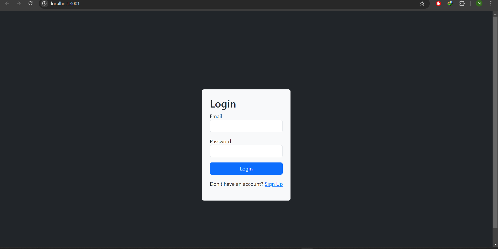
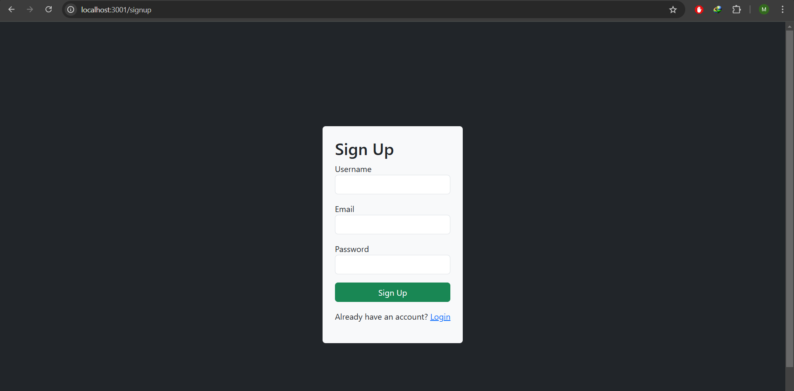
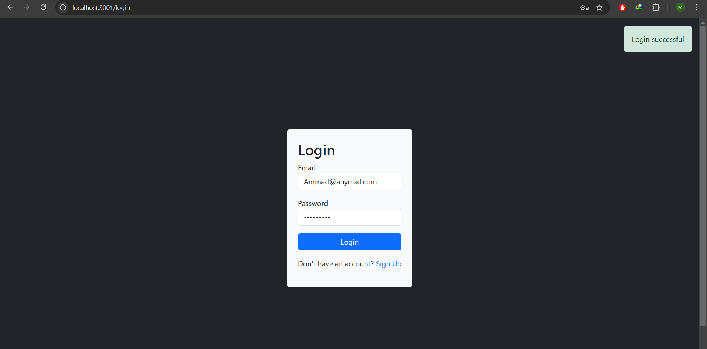
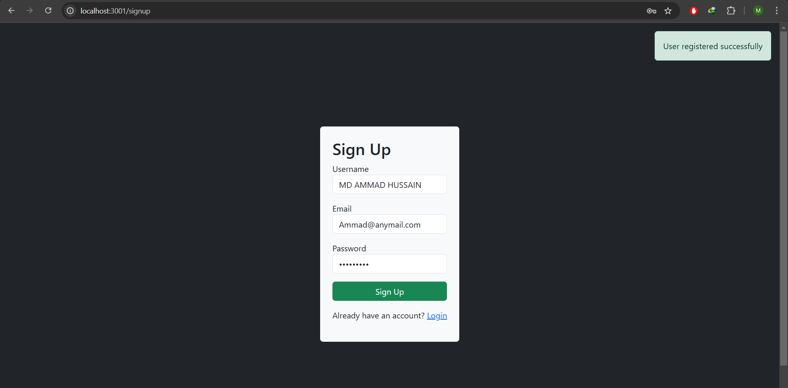

# Login & Signup System (MERN Stack)

This is a login and signup system built using the MERN stack (MongoDB, Express.js, React, Node.js). It allows users to register and log in.

## Features

- User registration (Signup) with hashed passwords for security (using bcrypt)
- User login with validation
- Input validation for forms to ensure proper data entry


## Technologies Used

- **Frontend:** React, Bootstrap
- **Backend:** Express.js, Node.js
- **Database:** MongoDB (using MongoDB Compass for database management)
- **Other:** Axios, CORS

## Screenshots

Below are some screenshots of the application:

- **Login Page**
  
  
- **Signup Page**
  
  
- **Email already exists**
  
  
- **Successful Login**
  
  
- **Successful Signup**
  

  - **Hashed Password in Database**
  

More screenshots can be found in the Screenshots folder.

## Prerequisites

Before running the project, ensure you have the following installed:

- **Node.js** (for running both the backend and frontend)
- **MongoDB Compass** (for managing the MongoDB database)
- **MongoDB** (for the database server)


## Getting Started

### 1. Clone the Repository

Clone the repository to your local machine:

```bash
git clone https://github.com/MDAMMADHUSSAIN/Login-Signup.git
cd Login-Signup
```


### 2. Setting Up MongoDB
     
  1. Ensure MongoDB is installed and running on your machine.
  2. The application uses the default MongoDB connection:
     - **Host:** `127.0.0.1`
     - **Port:** `27017`
     - **Database Name:** `mern_auth`
  3. The backend will automatically create the `mern_auth` database and necessary collections if they do not exist.

  
### 3. Setup Backend
  1. Navigate to the backend directory:
```bash
cd backend
```
  2. Install the necessary dependencies:
```bash
npm install
```
  3. Start the backend server:
```bash
node server.js
```
  The backend server will run on http://localhost:5000.
  
### 4. Setup Frontend (React)
  1. Navigate to the frontend directory:
```bash
cd frontend
```
  3. Install the necessary dependencies:
```bash
npm install
```
  3. Start the frontend development server:
```bash
npm start
```
  The frontend will be available at http://localhost:3000.
